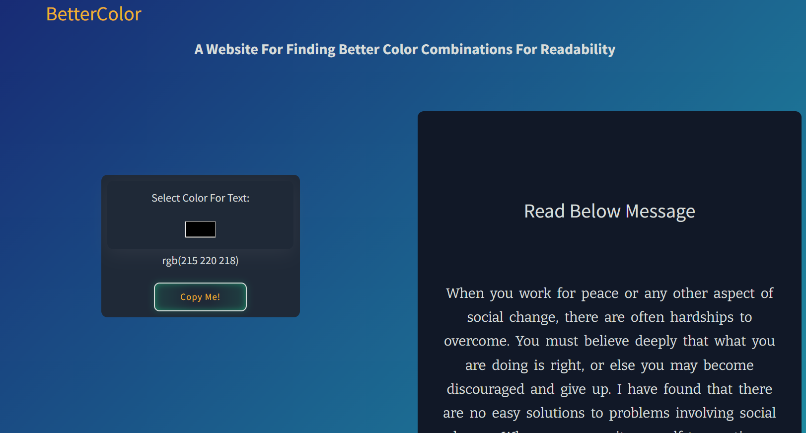

# Better Color
  
A Simple Project For Better Color Readability. You Can Easily Choose Best Color Readability For Any Background.
Improve the readability of text in your projects! Easily choose the most readable color for any background!

# Technologies and Tools :
* React.Js
* Bootstrap
* CSS
* ColorPicker

# Key Features:
* A color picker to pick the color you want!
* Change the color of text and backgrounds at your wish!
* Export color code values in multiple formats!
* Easily find the best background for any color text!

# We are participating in HACKTOBERFEST 2022

You can contribute to this open-source project. It is a part of Hacktoberfest 2022.
Before making any contributions, kindly go through the [CODE_OF_CONDUCT.md](https://github.com/HridoyHazard/BetterColor/blob/a328ebdcc9103dc8ec6ada1ca5291c24138eadcd/CODE_OF_CONDUCT.md).

After reading the Code of Conduct, follow the steps given in the [CONTRIBUTING.md]( https://github.com/HridoyHazard/BetterColor/blob/a328ebdcc9103dc8ec6ada1ca5291c24138eadcd/CODE_OF_CONDUCT.md)
